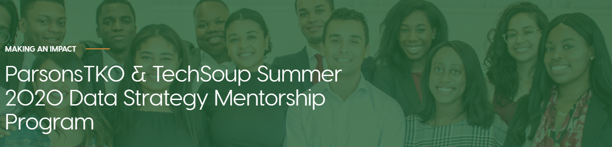

# DSMP_Air-Pollution-Project

## A group project within the scope of TechSoup and ParsonsTKO Summer 2020 Data Strategy Mentorship Program on the impact of air pollution.

A collaborative group project involving Thomas Kidd, Johnathan Padilla, Kenneth Lee, and Hadrien Picq; as fellows in the TechSoup and ParsonsTKO Summer 2020 Data Strategy Mentorship Program.
***
## Group Resources
### Published posts:
[An Introduction to Data Collection: REST APIs with Python & Pizzas](https://medium.com/@geocuriosity/an-introduction-to-data-collection-rest-apis-with-python-pizzas-7b682cef676c) by Hadrien Picq.

[An Introduction to Data Collection: Pulling OpenAQ Data from AWS S3 using AWS Athena](https://medium.com/@johnathan.d.padilla/an-introduction-to-data-collection-pulling-openaq-data-from-s3-using-aws-athena-26863b97c5cb) by Johnathan Padilla

[An Introduction to Data Cleaning: Using Regular Expressions to Clean your Data](https://medium.com/@johnathan.d.padilla/an-introduction-to-data-cleaning-using-regular-expressions-to-clean-your-data-9684ccfac74c) by Johnathan Padilla

### Reference notebooks:

[A Beginners Guide to API | Using Python to Collect Air Quality Data](https://nbviewer.jupyter.org/github/Kidd-Thomas/Air-Quality-Comparison/blob/master/AQS%20API%20GUIDE.ipynb?flush_cache=True) by Thomas Kidd.

[Data Wrangling](https://nbviewer.jupyter.org/github/HP-Nunes/dataStrategyMentorship_airQAproj/blob/master/data_Wrangling.ipynb) by Hadrien Picq.

### Instructions for the Team:

* Each folder is meant to store your work/notebooks for safekeeping. It is recommended that you also keep a copy of your work in your own repo.

* If there are files within your local directory that you do not wish to push to GitHub, create a .gitignore file and include:

> name_of_file.file_extension (ex: config.py)  
> /file_directory (ex: /heavy_dataset)

* Here is a common git workflow for reference:

> $ git init  
> $ git status  
> $ git pull git@github.com:HP-Nunes/DSMP_Air-Pollution-Project.git  
> $ git add .    
> $ git commit -m "COMMENTS ABOUT UPDATE/FILES"  
>  $ git push origin master  
>  /OR git push git@github.com:HP-Nunes/DSMP_Air-Pollution-Project.git master  
>  $ git status
***
## Currently on the Agenda 06/23

<b>Update: Agenda Setting for this week, and what to expect for the next meeting</b>

Welcome @Kenneth Lee to the group! I hope you can touch base with @Johnathan Padilla sometime this week. Kenneth has a particular interest in impact investing (fintech), and is programmatically savvy. He can definitely provide much needed wisdom if we'll be moving the project towards statistical analysis/modeling.

We had a fruitful conversation, and Kenneth made a number of very good points, namely: <b>What is the social impact of our project? What is the aim of our analysis on social actionability, what is the deliverable we wish to construe, and who is our intended audience?</b>

Here are some ideas that sprang up from the conversation:

* Thomas: fine particle pollution as a major cause of health hazards, and the economic loss due to the prevalence of asthma in the U.S. population;
* Hadrien: air pollution as a cause of environmental justice. Communities which are low-income and constituted of people-of-color, often as a legacy of Redlining, bear a greater disease burden than other groups in US cities;
* Kenneth: for whom exactly is the insight on "change in PM2.5 concentrations as a result of shelter-in-place guidelines" useful for? What is the social impact insight?

As we move on towards next week, I think we ought to define a problem statement on the social impact of air pollution. While we can retain the 'shelter-in-place' timeline within the scope of our analysis, we need to dive deeper into the social impact of the project. Thus, the objective for next week's meeting will be:

1. Defining a problem statement guiding our analysis;
2. Setting a tentative final deliverable for the project (for example, an extensive write-up/blog post, a data dashboard with RShiny etc);
3. Dividing tasks among ourselves, more within the vein of project management (this is not to discourage individual learning; however, setting a common deliverable will benefit everyone as far as the scope of this fellowship is concerned)

<b>What to do in the meantime:</b>

* Kenneth Lee will retrieve and explore the dataset on his own, to understand what we're working with;
* Thomas Kidd will be widening the scope of his dataset, by attempting to retrieve historical measurements prior to 2016, and retrieving a greater number of datapoints within a 15 KM radius from Seattle;
* HP-Nunes will create and organize a common GitHub repo, where we can commonly organize all of our code within one repo. I will also make some updates to my exploratory analysis;
* Johnathan Padilla Johnathan: TBD on how far you've gone through exploratory analysis.
* ALL: explore possible case studies/scope of analysis relating air pollution to social impact. Please comment below and share ideas/sources of projects we might to look out for inspiration.

Some updates (in addition to Johnathan's) were made to the group project's G-Sheet that Katia created on Monday, for an outline of the project moving forward. Please consult or make updates, it might help to clarify the direction of the project: https://docs.google.com/spreadsheets/d/1b8Iz3hi6WLKfd2-2N4bico8ALo4iXMH0OJGz9QcvlfU/edit#gid=1527921858

<em>Again, if any of you guys have questions, issues, or ambiguity moving forward, please communicate. Even if your availability is subject to change on a given day or week, we'll do our best to make it work.</em>

***
## Tech Stack

* Jupyter Notebook
* Python 3.8. 3

Packages:
* pandas
* tqdm
* sqlalchemy
* matplotlib
* seaborn
* requests
* os
