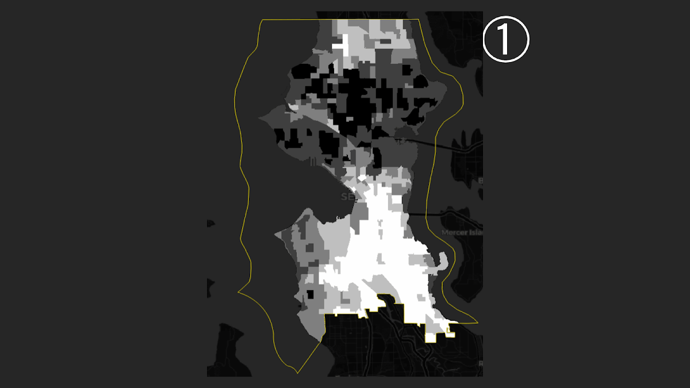
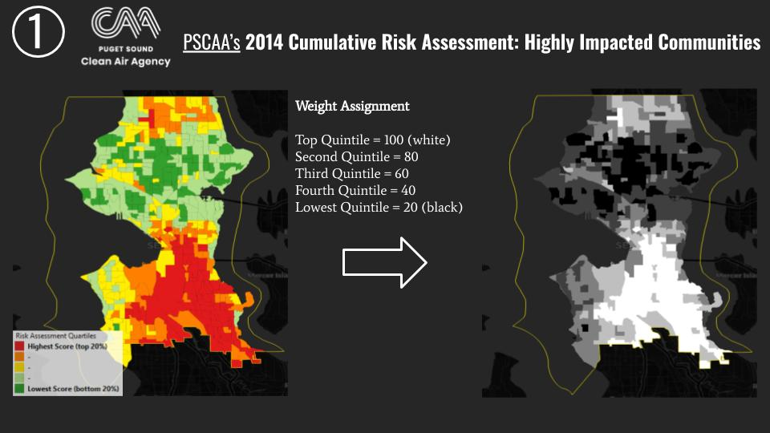
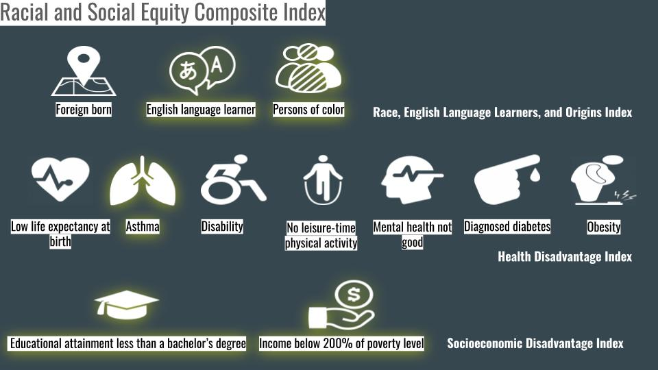
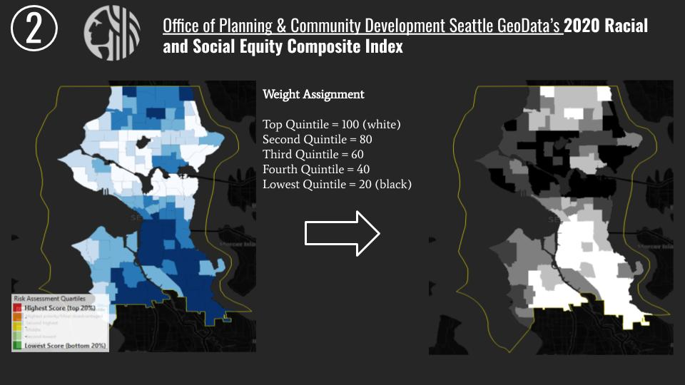
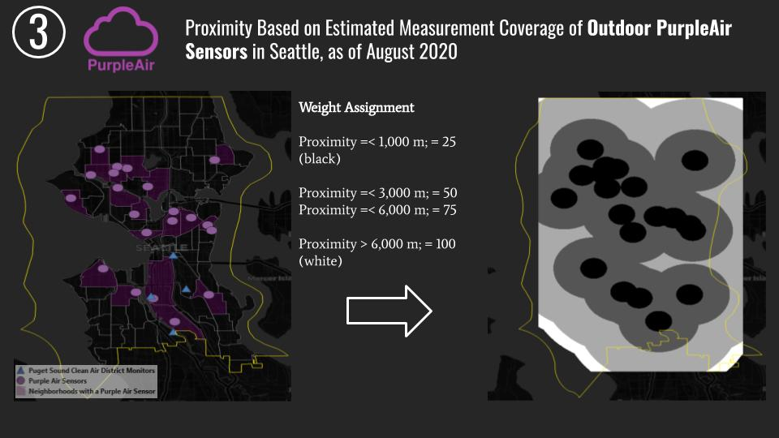
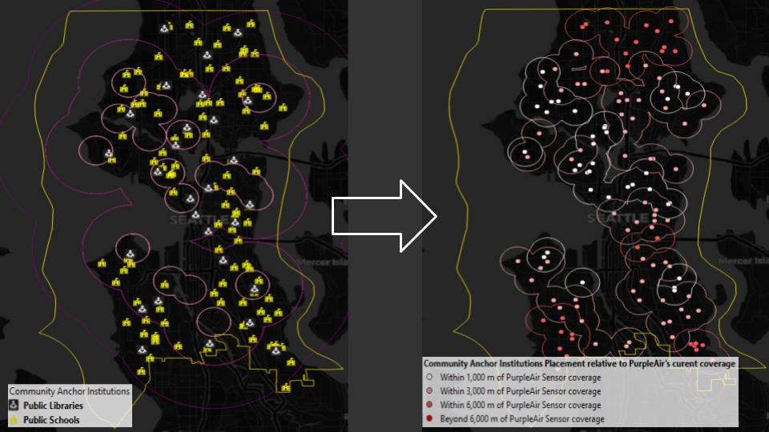
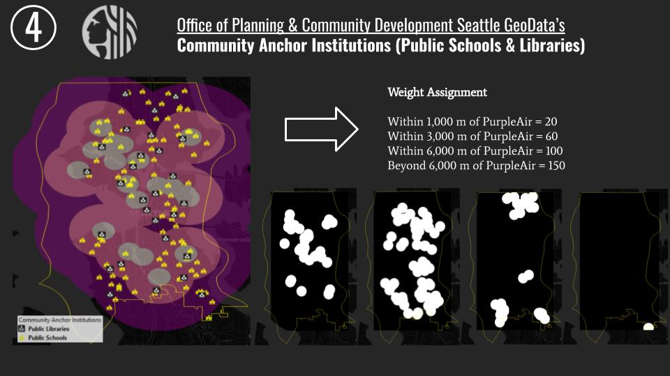
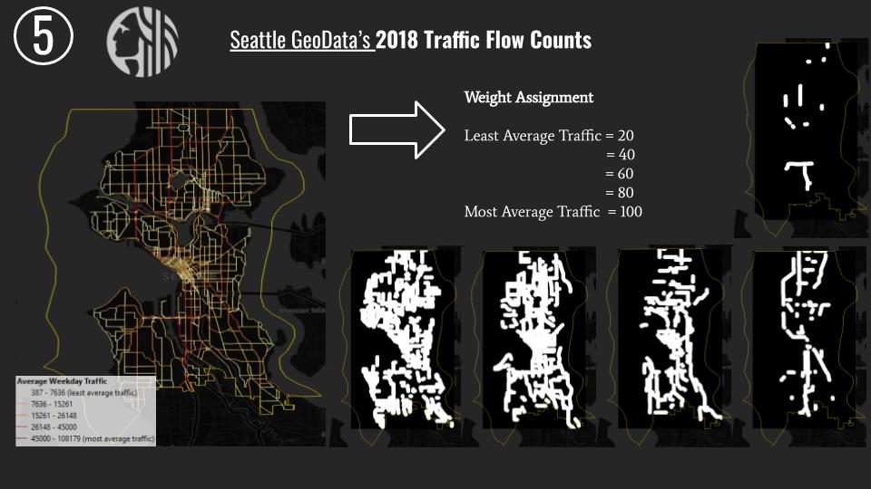
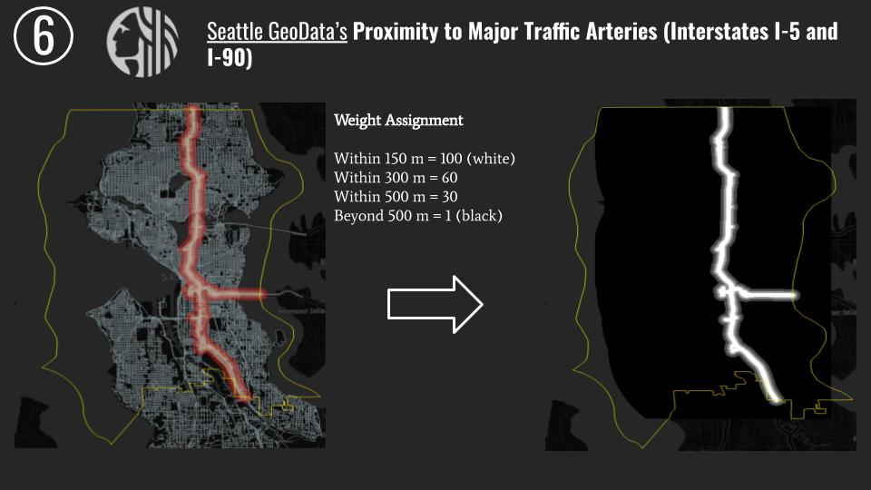

# Breathing Between the Lines: the legacy of red-lining on risk factors of air pollution in Seattle, WA

A collaborative project by Hadrien Picq and Johnathan Padilla

## Final project for the TechSoup and ParsonsTKO Summer 2020 Data Strategy Mentorship Program.
The project was presented on August 25th, 2020, and can be viewed and accessed: https://parsonstko.com/data-for-social-impact-conference/

### Summary
For decades, the US mortgage industry systematically denied mortgages to people of color through the practice of red-lining, which institutionalized racial segregation. This project team’s analysis focuses on Seattle, linking the city’s history of red-lining with current air pollution levels and health trends. Their data suggests that previously red-lined areas suffer from higher rates of pollution and asthma today than communities zoned as “desirable” in the 1940s. It also finds that people of color are currently underrepresented in air monitoring coverage in Seattle.
***
### Summary of Methodology
#### Multi-Criteria Weighted Overlay Analysis to identify neighborhoods of Seattle suitable for community-level air monitoring strategies, and observe overlaps with the Homeowner Loan Corporation 1936's "Grade of Security" (Redlining) Map.

<b> Part I: Feature Selection & Weight Assignment </b>

<b> 1. Puget Sound Clean Air Agency (PSCAA)’s 2014 Cumulative Risk Assessment: Highly Impacted Communities </b>

Data Source: https://pscleanair.gov/300/Documents

This study from the PSCAA informs its community selection in King's County to implement its [Focus Communities program](https://www.pscleanair.gov/382/Focus-Communities), which involves community-level planning and programming. The composite data was retained solely for the city of Seattle, and assigned weights based on the study's quantile ranking.

<b> 2. Office of Planning & Community Development Seattle GeoData’s 2020 Racial and Social Equity Composite Index </b>

Data Source: https://data-seattlecitygis.opendata.arcgis.com/datasets/225a4c2c50e94f2cb548a046217f49f7_0

The Racial and Social Equity Index combines information on race, ethnicity, and related demographics with data on socioeconomic and health disadvantages to identify where priority populations make up relatively large proportions of neighborhood residents. We included specifically the Composite Disadvantage composite index due to its emphasis on socio-economic determinants of healths, many of which are shared concerns as reflected in the PSCAA's [Focus Communities program](https://www.pscleanair.gov/382/Focus-Communities) (highlighted below). Weights were assigned based on the index's quantile ranking.

<b> 3. Zone of coverage of PurpleAir's sensors in Seattle, WA. </b>

Data Source: https://www.purpleair.com/map#15.19/37.781857/-122.489357

We looked at three radius range of coverage for each PurpleAir's sensor location in Seattle: 1,000m, 3,000m, and 6,000m. These ranges were based measurement scales as described on this [EPA's map of air quality monitors](https://www.epa.gov/outdoor-air-quality-data/interactive-map-air-quality-monitors), and through a discussion with an air specialist. The upper range represent the optimized range of the sensor, under the right placement and set of calibration, whereas 1,000 m is, I admit, an objective range to describe monitoring coverage at the level of a neighborhood. I then created buffers for each range, and assigned weights based on proximity to a PurpleAir sensor's coverage. Areas further than the maximum 6,000 m range received the highest weight.

Looking a bit further into this matter, beyond the scope of this project, the rule of thumb with low-cost sensors seem to be that they have better precision than accuracy. Meaning that a single sensor's real-time measurement may not be accurate, but that aggregated measurements from multiple sensors over time do offer a reasonable assessment of air quality. Furthermore, a [2019 study](https://www.sciencedirect.com/science/article/pii/S2590162119300152) suggests that high fidelity in measurements (for ultrafine particles) is attainable where the "sampling network is dense", with at least one sensor per squared kilometer. 

If I were to reconfigure this variable's parameter, I would create a grid over the city of Seattle with squares with areas equal to one squared kilometer. I would then count the number of sensors within each square and assign weights based on "grid density". I think this would be a better method than assuming a radius range of monitoring coverage, because I was making an assumption that these sensors, even within the lower range, all have equivalent sensing reach. 

<b> 4. Community Anchor Institutions </b>

Data Source (public schools): https://data-seattlecitygis.opendata.arcgis.com/datasets/a2e1128bd7a041358ce455c628ec9834_8

Data Source (public libraries): https://data-seattlecitygis.opendata.arcgis.com/datasets/seattle-public-libraries

This feature was included based on my internship experience at Caravan Studios, where I was researching funding opportunities leveraging public spaces for community-based air monitoring projects. Community Anchor Institutions are common location that are available to the public, including but not limited to schools, libraries, gymnasiums, and community centers. For the purpose of this project, I only selected the first two categories. 

Assuming that these sites can be designated to host a low-cost sensors, I didn't want to simply look at proximity, but avoid redundancy of sensing coverage relative to current PurpleAir's locations. Therefore, weights were assigned based on schools and libraries' proximity to a PurpleAir's sensor range of coverage, as shown below. Finally, I assigned a buffer around each site, with a weight corresponding to proximity to a PurpleAir's sensor range of coverage.

<b> 5. 2018 Seattle Traffic Count </b>

Data Source: https://data.seattle.gov/Land-Base/2018-Traffic-Flow-Counts/e9vy-mn8x

<b> 6. Proximity to Major Traffic Arteries (Interstates I-5 and I-90) </b>

Data Source: https://data.seattle.gov/Land-Base/Street-Network-Database-SND-/nvgs-5agd

***
## Tech Stack

* Jupyter Notebook
* Python 3.8. 3
* QGIS

Packages:
* pandas
* tqdm
* sqlalchemy
* matplotlib
* seaborn
* requests
* os
***
## Group Resources
### Published posts:
[An Introduction to Data Collection: REST APIs with Python & Pizzas](https://medium.com/@geocuriosity/an-introduction-to-data-collection-rest-apis-with-python-pizzas-7b682cef676c) by Hadrien Picq.

[An Introduction to Data Collection: Pulling OpenAQ Data from AWS S3 using AWS Athena](https://medium.com/@johnathan.d.padilla/an-introduction-to-data-collection-pulling-openaq-data-from-s3-using-aws-athena-26863b97c5cb) by Johnathan Padilla

[An Introduction to Data Cleaning: Using Regular Expressions to Clean your Data](https://medium.com/@johnathan.d.padilla/an-introduction-to-data-cleaning-using-regular-expressions-to-clean-your-data-9684ccfac74c) by Johnathan Padilla

[Spatial Intersects with Geopandas](https://medium.com/analytics-vidhya/spatial-intersects-with-geopandas-420c98915ca9) by Hadrien Picq

### Reference notebooks:

[A Beginners Guide to API | Using Python to Collect Air Quality Data](https://nbviewer.jupyter.org/github/Kidd-Thomas/Air-Quality-Comparison/blob/master/AQS%20API%20GUIDE.ipynb?flush_cache=True) by Thomas Kidd.

[Data Wrangling](https://nbviewer.jupyter.org/github/HP-Nunes/dataStrategyMentorship_airQAproj/blob/master/data_Wrangling.ipynb) by Hadrien Picq.
