# Breathing Between the Lines: the legacy of red-lining on risk factors of air pollution in Seattle, WA

A collaborative project by Hadrien Picq & Johnathan Padilla (June - August 2020), and Thomas Kidd (June 2020)

## Final project for the TechSoup and ParsonsTKO Summer 2020 Data Strategy Mentorship Program.

This project was presented and recorded on August 25th, 2020 for ParsonsTKO's Data for Social Impact: Racial and Economic Justice Conference. The presentation's material and recording can be accessed at https://parsonstko.com/data-for-social-impact-conference/

Watch the presentation

A storymap of the content is also accessible: https://www.arcgis.com/apps/Cascade/index.html?appid=30ed983e06024f278aba835cc1287151

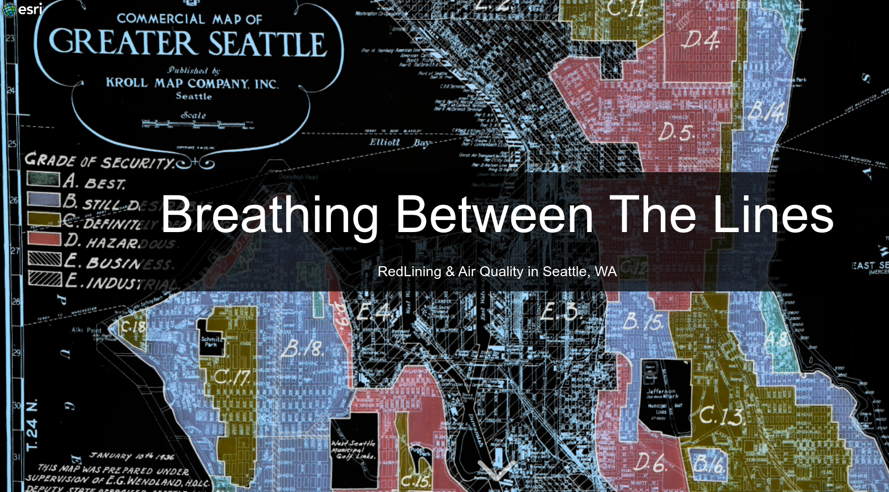

### Summary

Fine Particulate pollution is an ubiquitous and major environmental threat to health. Furthermore, the burden of air pollution in U.S. cities correspond to socio-economic determinants of health, which can be traced to the legacy of redlining. This research identified neighborhoods in Seattle, WA using multiple indicators of vulnerability to 1) inform appropriate agencies and regulators on where to deploy local interventions to redress inequities of air pollution, and 2) to inform the general public about the link to the current threat of urban air pollution and the historical legacy of discrimination.

Our research four general areas in the city of Seattle that have inadequate local monitoring coverage and are vulnerable to burdens of pollution. 3 of the 4 areas bear strong overlap with unfavorable ratings by the Homeowner Loan Corporation, the federal agency responsible for assigning grades of security to neighborhoods across the U.S. We recommend that risk assessment ought to both leverage local knowledge about impacted communities, and consider historical processes in understanding contemporary societal inequities.

***
### Reference IPython Notebooks
#### Data Collection
* [Using APIs to collect air quality data](https://nbviewer.jupyter.org/github/HP-Nunes/Breathing-Between-the-Lines/blob/master/Thomas/AQS%20API%20GUIDE.ipynb) by Thomas Kidd
* [Using OpenAQ's API and AWS](https://nbviewer.jupyter.org/github/HP-Nunes/Breathing-Between-the-Lines/blob/master/Thomas/Air%20Quality.ipynb) by Thomas Kidd
* [Using OpenAQ's API, a beginner's walkthrough](https://nbviewer.jupyter.org/github/HP-Nunes/Breathing-Between-the-Lines/blob/master/Hadrien/api_OpenAQ.ipynb) by Hadrien Picq

#### Data Wrangling
* [Wrangling a PurpleAir's CSV](https://nbviewer.jupyter.org/github/HP-Nunes/Breathing-Between-the-Lines/blob/master/Johnathan/Air%20Quality%20notebook.ipynb) by Johnathan Padilla
* [Batching Function for wrangling multiple PurpleAir's CSV](https://github.com/HP-Nunes/Breathing-Between-the-Lines/blob/master/Hadrien/purpleAir.py) by Hadrien Picq (Python script)

#### Data Analysis
* [Gathering insights from U.S. Census Data & HOLC-grade's boundaries (formatted in QGIS)](https://nbviewer.jupyter.org/github/HP-Nunes/Breathing-Between-the-Lines/blob/master/Johnathan/SummarizingDemographicVariablesWithinPurpleAirMonitorZoneOfCoverage.ipynb) by Johnathan Padilla
* [Extracting Demographic Info of Interest by HOLC-grade boundaries](https://nbviewer.jupyter.org/github/HP-Nunes/Breathing-Between-the-Lines/blob/master/Hadrien/mapping.ipynb) by Hadrien Picq

***
### Summary of Methodology
#### Multi-Criteria Weighted Overlay Analysis to identify neighborhoods of Seattle suitable for community-level air monitoring strategies, and observe overlaps with the Homeowner Loan Corporation 1936's "Grade of Security" (Redlining) Map.

##### Part I: Feature Selection & Weight Assignment

<b> 1. Puget Sound Clean Air Agency (PSCAA)’s 2014 Cumulative Risk Assessment: Highly Impacted Communities </b>

Data Source: https://pscleanair.gov/300/Documents

This study from the PSCAA informs its community selection in King's County to implement its [Focus Communities program](https://www.pscleanair.gov/382/Focus-Communities), which involves community-level planning and programming. The composite data was retained solely for the city of Seattle, and assigned weights based on the study's quantile ranking.

<b> 2. Office of Planning & Community Development Seattle GeoData’s 2020 Racial and Social Equity Composite Index </b>

Data Source: https://data-seattlecitygis.opendata.arcgis.com/datasets/225a4c2c50e94f2cb548a046217f49f7_0

The Racial and Social Equity Index combines information on race, ethnicity, and related demographics with data on socioeconomic and health disadvantages to identify where priority populations make up relatively large proportions of neighborhood residents. We included specifically the Composite Disadvantage composite index due to its emphasis on socio-economic determinants of healths, many of which are shared concerns as reflected in the PSCAA's [Focus Communities program](https://www.pscleanair.gov/382/Focus-Communities) (highlighted below). Weights were assigned based on the index's quantile ranking.

<b> 3. Zone of coverage of PurpleAir's sensors in Seattle, WA. </b>

Data Source: https://www.purpleair.com/map#15.19/37.781857/-122.489357

We looked at three radius range of coverage for each PurpleAir's sensor location in Seattle: 1,000m, 3,000m, and 6,000m. These ranges were based measurement scales as described on this [EPA's map of air quality monitors](https://www.epa.gov/outdoor-air-quality-data/interactive-map-air-quality-monitors), and through a discussion with an air specialist. The upper range represent the optimized range of the sensor, under the right placement and set of calibration, whereas 1,000 m is, I admit, an objective range to describe monitoring coverage at the level of a neighborhood. I then created buffers for each range, and assigned weights based on proximity to a PurpleAir sensor's coverage. Areas further than the maximum 6,000 m range received the highest weight.

Looking a bit further into this matter, beyond the scope of this project, the rule of thumb with low-cost sensors seem to be that they have better precision than accuracy. Meaning that a single sensor's real-time measurement may not be accurate, but that aggregated measurements from multiple sensors over time do offer a reasonable assessment of air quality. Furthermore, a [2019 study](https://www.sciencedirect.com/science/article/pii/S2590162119300152) suggests that high fidelity in measurements (for ultrafine particles) is attainable where the "sampling network is dense", with at least one sensor per squared kilometer. 

If I were to reconfigure this variable's parameter, I would create a grid over the city of Seattle with squares with areas equal to one squared kilometer. I would then count the number of sensors within each square and assign weights based on "grid density". I think this would be a better method than assuming a radius range of monitoring coverage, because I was making an assumption that these sensors, even within the lower range, all have equivalent sensing reach. 

<b> 4. Community Anchor Institutions </b>

Data Source (public schools): https://data-seattlecitygis.opendata.arcgis.com/datasets/a2e1128bd7a041358ce455c628ec9834_8

Data Source (public libraries): https://data-seattlecitygis.opendata.arcgis.com/datasets/seattle-public-libraries

This feature was included based on my internship experience at Caravan Studios, where I was researching funding opportunities leveraging public spaces for community-based air monitoring projects. Community Anchor Institutions are common location that are available to the public, including but not limited to schools, libraries, gymnasiums, and community centers. For the purpose of this project, I only selected the first two categories. 

Assuming that these sites can be designated to host a low-cost sensors, I didn't want to simply look at proximity, but avoid redundancy of sensing coverage relative to current PurpleAir's locations. Therefore, weights were assigned based on schools and libraries' proximity to a PurpleAir's sensor range of coverage, as shown below. Finally, I assigned a buffer around each site, with a weight corresponding to proximity to a PurpleAir's sensor range of coverage.

<b> 5. 2018 Seattle Traffic Count </b>

Data Source: https://data.seattle.gov/Land-Base/2018-Traffic-Flow-Counts/e9vy-mn8x

Motor vehicles contribute to more than 50% of air pollution in urban areas, therefore proximity to arteries of traffic was an important perimeter to consider. Using a 2018 traffic count survey, I broke down the data into 5 categories using Natural Jenks. I then exported and dissolved each category as its own layer, and created a 300 m buffer around each categories to which I assigned weights. I chose [300 m as the estimated lower range of zonal exposure]
(https://www.ncbi.nlm.nih.gov/books/NBK361807/#proximityc.s3:~:text=The%20Health%20Effects%20Institute%20Panel%20identified,pollution%20concentrations%2C%20meteorological%20conditions%2C%20and%20season) to fine particulate matter.

<b> 6. Proximity to Major Traffic Arteries (Interstates I-5 and I-90) </b>

Data Source: https://data.seattle.gov/Land-Base/Street-Network-Database-SND-/nvgs-5agd

According to the [Center for Disease Control](https://ephtracking.cdc.gov/showProximityToHighways.action), about 4% of the U.S. population lives within 150 meters (about 2 city blocks) of a major highway. This suggests that people living in these areas are at increased risk for exposure to traffic-related air pollutants, including particulate matter. I identified Interstates I-5 and I-90 as Seattle's two major traffic arteries, and assigned weights based on three ranges of proximity.

##### Part II: Converting the Composite Indice from Raster to Vector

After converting all our features of interest into discrete raster layer, I used the "raster calculator" tool in QGIS to sum of weights into a composite raster layer.

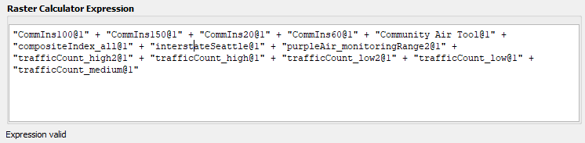

The composite raster was then converted into a vector layer, averaging the sum of weights for each nieghborhoods, and subsequently categorized into quantiles.

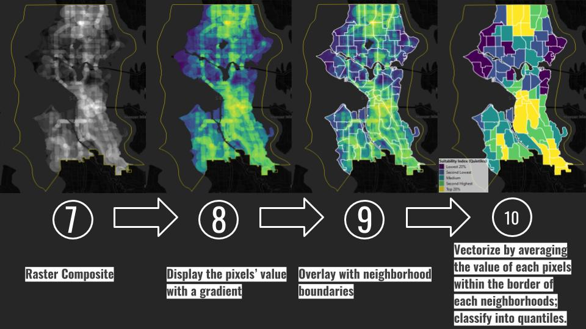

##### Part III: Overlays and Observations

The multi-criteria analysis identified 11 of the 22 neighborhoods designated under the PSCAA's 2014 Risk Assessment, within the top quantile.

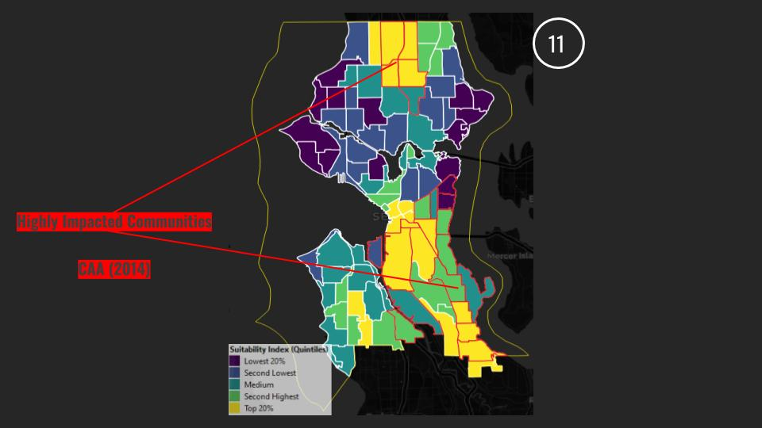

Looking at areas selected under the PSCAA's Focus Communities Program, only the Chinatown-International District neighborhood was within the analysis' top quantile.

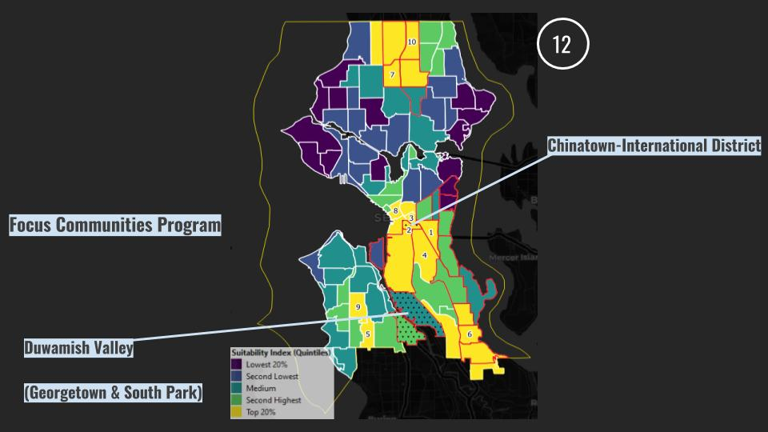

Four general areas with adjacent neighborhoods identified in the top quantile were identified, they are: Northgate, Delridge, Rainer Valley, and the Central District (downtown-industrial area). With the exception of Northgate, which was not incorporated into the city of Seattle in 1936, these four areas bear strong overlaps with unfavorable HOLC grades of security.

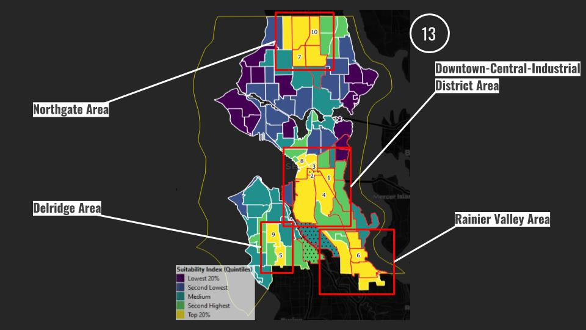  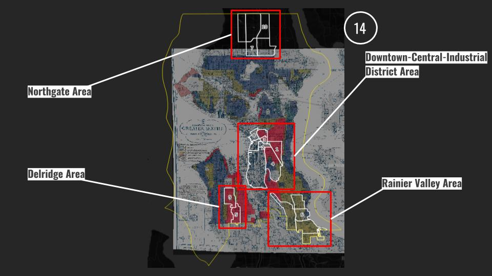

##### Part IV: Redlining

We observed that the areas designated within the top quantile of our analysis bear a strong overlap with unfavorable HOLC's grades of security, with the exception of the Northgate Area. We must also stress that there are other factors of residential segregation that cannot be solely be explained by redlining, such as racially discriminatory residential covenants. We also look at the distribution of vulnerable age groups suceptible to asthma within those areas.

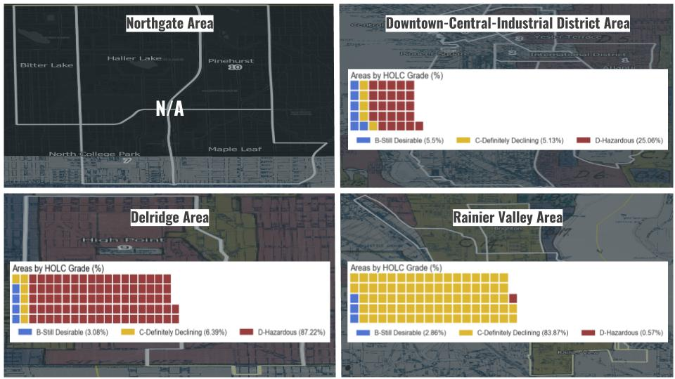  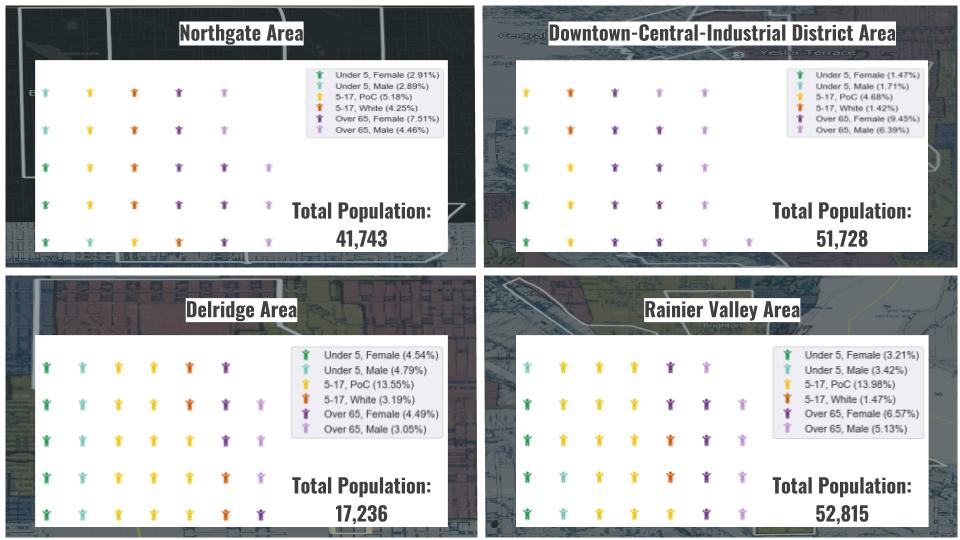

We identified the Atlantic neighborhood as the number 1 ranked area in our analysis, a formerly redlined district with a large youth population of color.

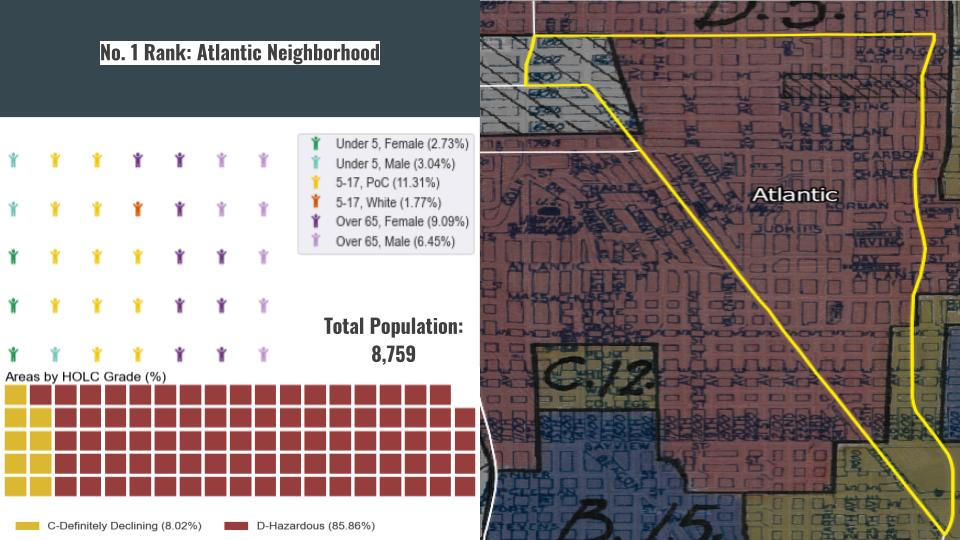

##### Part V: Evaluating the multi-criteria model
Using spatial autocorrelation, we observe whether the indices of our multi-criteria analysis are clustered (i.e. neighborhoods with similar index value will be close to one another) or dispersed.

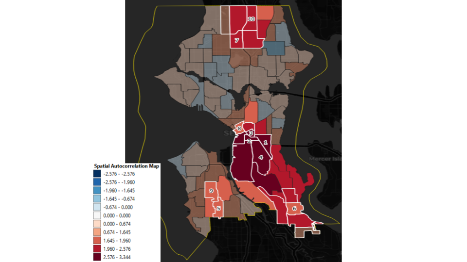

Neighborhoods where Moran's I was not statistically significant (where p > 0.05) are faded. A positive Moran's I indicates positive autocorrelation, i.e. similar values are clustered together. Nearly all neighborhoods identified in the top quantile of our multi-criteria overlay analysis (white outlines) exhibited positive autocorrelation and were statistically significant at the 5% significance level.

What this indicates is that the vulnerability indices within the top quantile of our multi-criteria overlay analysis are not randomly distributed.
***
## Feedback & Follow-Up (Updated November 2020)

I was fortunate to have staff at the Puget Sound Clean Air Agency review this project, quoted below:

> Here are a few technical suggestions for your analysis: 
>
> -The nature of the distribution of PM2.5 is generally characterized by a 5km radius. Your analysis shows a 6km radius covers almost the entire area.  Of course, when looking at the whole four county region there are plenty of locations that are >5km away from a monitor.
>
> -The analysis acknowledges the regulatory monitors, but doesn’t include them. Prioritized neighborhoods #2 and #3 are right next to the Chinatown-International District station.  It probably isn't necessary to prioritize having a Purple Air next to a regulatory monitor, except for calibration purposes.
>
> -Topography/proximity to Puget Sound (or similar meteorological surrogates) could be considered. Some of these appear up the hill like area #4, 7, 9, & 10 are potentially higher elevation, possibly cleaner areas.
>
> -> The CAT tool takes into account a lot of the other layers you add in separately. This basically double counts those measures.

***
## Tech Stack

* Jupyter Notebook
* Python 3.8.3
* QGIS 3.14.1
  * CrimeStat Plugin for Spatial Autocorrelation analysis

Packages:
* pandas
* tqdm
* sqlalchemy
* matplotlib
* seaborn
* requests
* os
***
## Group Resources
### Published posts:
[An Introduction to Data Collection: REST APIs with Python & Pizzas](https://medium.com/@geocuriosity/an-introduction-to-data-collection-rest-apis-with-python-pizzas-7b682cef676c) by Hadrien Picq.

[An Introduction to Data Collection: Pulling OpenAQ Data from AWS S3 using AWS Athena](https://medium.com/@johnathan.d.padilla/an-introduction-to-data-collection-pulling-openaq-data-from-s3-using-aws-athena-26863b97c5cb) by Johnathan Padilla

[An Introduction to Data Cleaning: Using Regular Expressions to Clean your Data](https://medium.com/@johnathan.d.padilla/an-introduction-to-data-cleaning-using-regular-expressions-to-clean-your-data-9684ccfac74c) by Johnathan Padilla

[Spatial Intersects with Geopandas](https://medium.com/analytics-vidhya/spatial-intersects-with-geopandas-420c98915ca9) by Hadrien Picq

### Reference notebooks:

[A Beginners Guide to API | Using Python to Collect Air Quality Data](https://nbviewer.jupyter.org/github/Kidd-Thomas/Air-Quality-Comparison/blob/master/AQS%20API%20GUIDE.ipynb?flush_cache=True) by Thomas Kidd.

[Data Wrangling](https://nbviewer.jupyter.org/github/HP-Nunes/dataStrategyMentorship_airQAproj/blob/master/data_Wrangling.ipynb) by Hadrien Picq.
